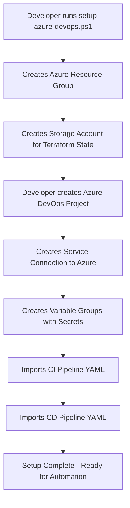
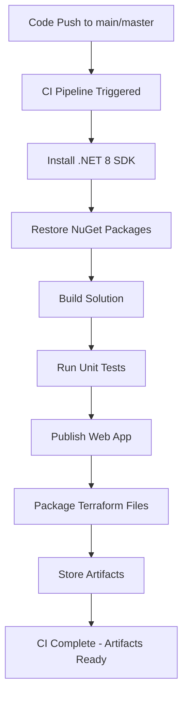
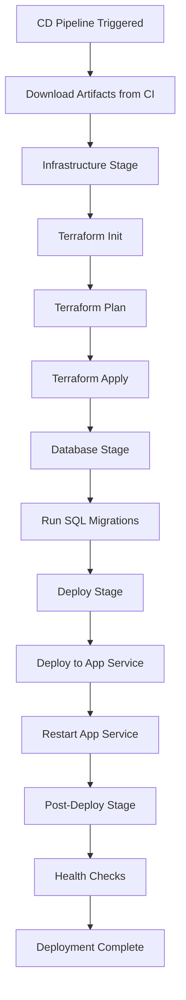
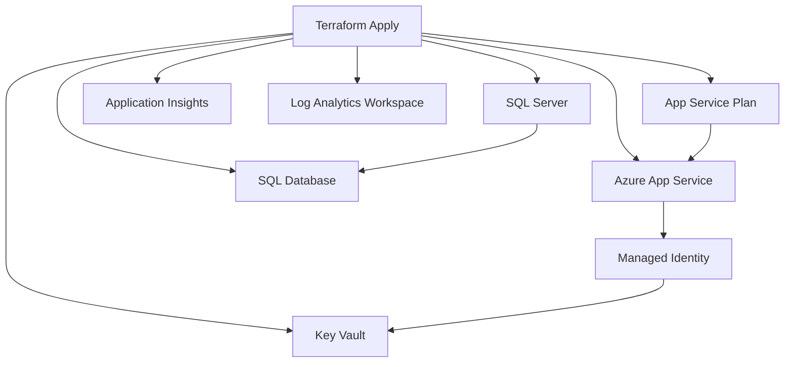

# Azure DevOps Pipeline Execution Flow

This document explains exactly how the Infrastructure as Code (IaC) and CI/CD pipelines execute in Azure DevOps.

## 🔄 **Complete Execution Flow**

### **Phase 1: One-Time Setup (Manual Steps)**



**What happens in setup script:**
```powershell
# This script runs ONCE to prepare infrastructure
.\scripts\setup-azure-devops.ps1 -SubscriptionId "xxx" -ResourceGroupName "payflowpro-terraform-rg"

# Creates:
# ✅ Resource Group: payflowpro-terraform-rg
# ✅ Storage Account: payflowproterraform
# ✅ Blob Container: tfstate
# ✅ Generates SQL password
```

### **Phase 2: Automated Pipeline Execution**

#### **🔨 CI Pipeline Flow (Continuous Integration)**



**Artifacts created:**
- `web-app.zip` - Compiled .NET application
- `terraform/` - Infrastructure code
- `database/` - SQL migration scripts

#### **🚀 CD Pipeline Flow (Continuous Deployment)**



## 🔧 **Infrastructure Stage Deep Dive**

### **What Terraform Does Automatically:**

1. **Terraform Init:**
   ```bash
   terraform init \
     -backend-config="resource_group_name=payflowpro-terraform-rg" \
     -backend-config="storage_account_name=payflowproterraform" \
     -backend-config="container_name=tfstate" \
     -backend-config="key=dev.terraform.tfstate"
   ```

2. **Terraform Plan:**
   ```bash
   terraform plan \
     -var-file="dev.tfvars" \
     -var="sql_admin_password=$(sqlAdminPassword)" \
     -out=tfplan
   ```

3. **Terraform Apply:**
   ```bash
   terraform apply -auto-approve tfplan
   ```

### **Azure Resources Created/Updated:**



## 📋 **Pipeline Variables & Secrets**

### **Variables Used in Pipelines:**

```yaml
# From Variable Group: PayFlowPro-Variables
variables:
  azureServiceConnection: 'azure-payflowpro-connection'
  terraformStateResourceGroup: 'payflowpro-terraform-rg'
  terraformStateStorageAccount: 'payflowproterraform'
  sqlAdminUsername: 'sqladmin'
  sqlAdminPassword: '$(sqlAdminPassword)' # Secret variable
  subscriptionId: 'your-subscription-id'
```

### **How Secrets Flow:**

1. **Setup Script** → Generates strong SQL password
2. **Variable Group** → Store password as secret variable
3. **CD Pipeline** → Injects password into Terraform
4. **Terraform** → Creates SQL Server with password
5. **Key Vault** → Stores connection string securely
6. **App Service** → Retrieves connection string via Managed Identity

## 🎯 **Execution Examples**

### **Example 1: First Deployment**

```powershell
# 1. One-time setup (manual)
.\scripts\setup-azure-devops.ps1 -SubscriptionId "12345" -ResourceGroupName "payflowpro-terraform-rg"

# 2. Configure Azure DevOps (manual)
# - Create service connection
# - Import pipeline YAML files
# - Set up variable groups

# 3. Trigger CI Pipeline (automated)
git push origin main  # This triggers CI pipeline

# 4. Run CD Pipeline (manual trigger)
# Go to Azure DevOps → Pipelines → CD Pipeline → Run
# Select environment: dev
# Pipeline automatically:
#   - Downloads artifacts
#   - Runs terraform to create ALL Azure resources
#   - Deploys application
#   - Runs health checks
```

### **Example 2: Subsequent Deployments**

```powershell
# Developer makes changes and pushes
git add .
git commit -m "Add new feature"
git push origin main

# Automatically happens:
# ✅ CI Pipeline runs (build, test, package)
# ✅ Artifacts stored

# Manual trigger:
# ✅ Run CD Pipeline
# ✅ Terraform updates only changed resources
# ✅ Application deployed with zero downtime
```

## 🔍 **Pipeline Monitoring**

### **What You See in Azure DevOps:**

1. **CI Pipeline Run:**
   - Build logs
   - Test results
   - Code coverage reports
   - Artifact publishing confirmation

2. **CD Pipeline Run:**
   - Terraform plan output (what will change)
   - Terraform apply logs (what was changed)
   - Database migration results
   - App Service deployment status
   - Health check results

### **What You See in Azure Portal:**

- New/updated resources appearing
- Application Insights telemetry
- App Service logs
- SQL Database activity
- Key Vault access logs

## ⚡ **Key Differences from Manual Deployment**

| Manual Process | Automated Pipeline |
|---------------|-------------------|
| Click through Azure Portal | Terraform code defines everything |
| Manually upload app files | Automated deployment from artifacts |
| Manual SQL script execution | Automated migration pipeline |
| Manual health checks | Automated smoke tests |
| Manual rollback if issues | Automated rollback capabilities |
| Prone to human error | Consistent, repeatable process |

The beauty of this setup is that after the one-time configuration, **everything runs automatically** with full traceability, security, and consistency! 🎉